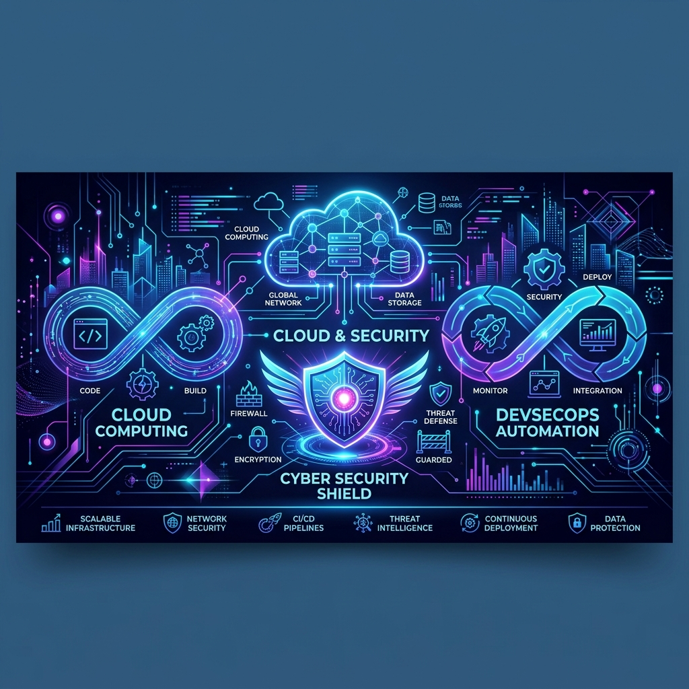
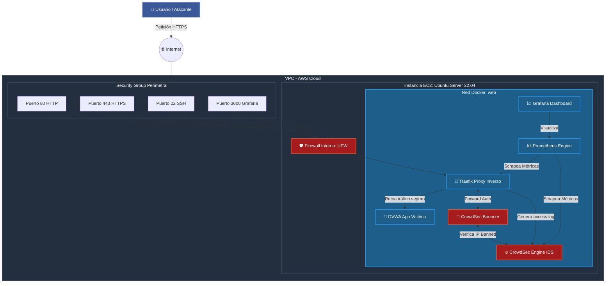
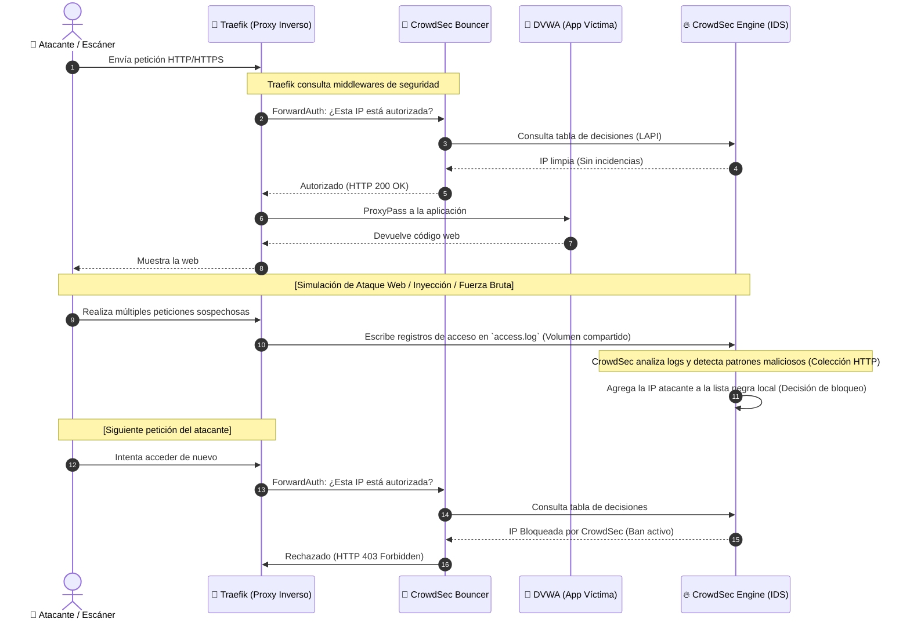

# 🛡️ Infraestructura Cloud Automatizada & DevSecOps (TFG ASIR)



Este repositorio contiene la implementación completa de una **Infraestructura Cloud Segura por Diseño (DevSecOps)** desplegada en **AWS** de forma completamente automatizada mediante **Infraestructura como Código (IaC)** y **Gestión de Configuración**.

El proyecto demuestra cómo migrar del paradigma de administración tradicional ("Servidores Mascota") al paradigma de automatización moderno ("Servidores Ganado"), implementando políticas avanzadas de ciberseguridad, prevención activa de intrusiones y observabilidad en tiempo real.

---

## 🛠️ Tecnologías Utilizadas

Un stack tecnológico robusto y moderno enfocado en la automatización y la seguridad:

| Área | Tecnologías |
|---|---|
| **Proveedor Cloud** |  |
| **Infraestructura como Código** |  |
| **Gestión de Configuración** |  |
| **Virtualización y Contenedores** |  |
| **Proxy Inverso y SSL** |  |
| **Seguridad Activa (IDS/IPS)** |  |
| **Métricas y Observabilidad** |   |

---

## 📐 Arquitectura del Sistema

La arquitectura está diseñada bajo el principio de **Defensa en Profundidad**, combinando firewalls perimetrales en la nube con firewalls a nivel de host, proxies seguros y agentes de seguridad activa en contenedores aislados.



---

## 🔒 Bucle de Seguridad Activa: Detección y Mitigación (IPS)

A diferencia de las soluciones pasivas, este sistema detecta comportamientos sospechosos en tiempo real mediante **CrowdSec** y los bloquea directamente en el punto de entrada (**Traefik**) antes de que impacten en la aplicación interna.



---

## 📂 Estructura del Repositorio

La organización del código sigue los estándares de la industria para la gestión de proyectos de infraestructura y seguridad:

```bash
.
├── ansible/                  # Automatización de la configuración del SO y Docker
│   ├── inventory.ini         # Definición de hosts de destino (IPs del servidor)
│   └── playbook.yml          # Tareas de aprovisionamiento, hardening y despliegue
├── terraform/                # Definición de Infraestructura como Código (IaC)
│   ├── main.tf               # Aprovisionamiento de VPC, Security Groups e Instancia EC2
│   ├── outputs.tf            # Variables de salida (IP Pública de la instancia)
│   └── provider.tf           # Configuración del proveedor de AWS
├── docker/                   # Definición y configuración de contenedores microservicios
│   ├── docker-compose.yml    # Orquestación de Traefik, CrowdSec, DVWA y Observabilidad
│   ├── security/             # Configuraciones específicas de CrowdSec (logs, acquis)
│   └── observability/        # Configuraciones y dashboards de Prometheus y Grafana
├── scripts/                  # Scripts auxiliares y herramientas de pentesting
│   ├── attack.py             # Script de simulación de ataques multihilo (User-Agent Nikto)
│   └── setup_wsl.sh          # Ayudante para preparar el entorno en Windows (WSL)
├── docs/                     # Documentación técnica, guías y recursos gráficos
│   └── images/               # Recursos gráficos y multimedia del README
├── .gitignore                # Reglas de exclusión de Git (prevención de fugas de claves)
├── LICENSE                   # Licencia de código abierto MIT
└── README.md                 # Guía general de presentación
```

---

## 🚀 Despliegue Automatizado en 3 Pasos

El despliegue está diseñado bajo la filosofía **Zero-Touch**. Sigue estos pasos secuenciales:

<details>
<summary>📋 Requisitos Previos</summary>

* Tener configuradas las credenciales de AWS (`aws configure` o variables de entorno de AWS Academy).
* Terraform instalado en tu máquina local.
* Ansible instalado en tu máquina local o en WSL.
* Clave privada SSH (`vockey.pem` / `vockey` o `labsuser.pem`) accesible.
</details>

### Paso 1: Infraestructura como Código (Terraform)
Accede a la carpeta de Terraform, inicializa los proveedores y despliega la infraestructura en AWS.
```bash
cd terraform
terraform init
terraform apply -auto-approve
```
*Al finalizar, Terraform imprimirá la dirección IP pública del servidor:* `server_public_ip = "X.X.X.X"`.

### Paso 2: Configuración del Sistema y Hardening (Ansible)
Edita el archivo `ansible/inventory.ini` reemplazando la dirección IP por la obtenida en el paso anterior. Luego ejecuta el playbook:
```bash
cd ../ansible
ansible-playbook -i inventory.ini playbook.yml
```
Este script configurará las dependencias, instalará Docker, endurecerá el SSH, y levantará el firewall local. Además, **de forma 100% automatizada**, recuperará la IP del servidor para configurar las reglas de dominio dinámico en Traefik y registrará el CrowdSec Bouncer con una clave estática segura.

### Paso 3: Verificación y Servicios Activos
Los servicios se levantarán de manera automática a través del playbook de Ansible en contenedores Docker aislados. Puedes verificar que la aplicación víctima está activa accediendo a las siguientes URLs:
* **DVWA (Segura con HTTPS)**: `https://<IP-PUBLICA>.nip.io/dvwa`
* **whoami (Validación HTTPS)**: `https://<IP-PUBLICA>.nip.io/whoami`
* **Grafana (Monitoreo)**: `http://<IP-PUBLICA>:3000` (Credenciales: `admin` / `admin`)

*Nota: La primera vez que accedas a la URL HTTPS, Let's Encrypt puede tardar entre 10 y 30 segundos en negociar el certificado digital. Si ves un error de carga, espera unos segundos y refresca.*

---

## 🔬 Demostración de Seguridad en Acción

### 1. Simulación de un ataque web
Para verificar que el sistema de detección y prevención activa (CrowdSec IPS) funciona, podemos simular un ataque de escaneo web rápido contra la aplicación víctima (DVWA) desde una máquina externa.

Puedes hacerlo de dos formas:

**Opción A: Ejecutar el script Python automatizado (Recomendada)**
Ejecuta el script proporcionado en la carpeta de herramientas pasándole la IP pública del servidor:
```bash
python scripts/attack.py <IP-PUBLICA>
```

**Opción B: Mediante bucle curl en Linux**
```bash
# Simular un ataque web usando curl inyectando patrones maliciosos en la URL
for i in {1..30}; do curl -H "Host: <IP-PUBLICA>.nip.io" -s -o /dev/null -w "%{http_code}\n" "http://<IP-PUBLICA>/dvwa/?id=../../etc/passwd"; done
```

### 2. Comportamiento esperado
1. **Las primeras peticiones** devolverán un código de respuesta regular (`200 OK` o `302 Redirect`).
2. **Tras superar el umbral de seguridad**, CrowdSec analiza los registros del log de Traefik, detecta el intento de Local File Inclusion (LFI) o escaneo automatizado y añade la IP al bouncer.
3. **Las peticiones posteriores** recibirán instantáneamente un código **`403 Forbidden`** de Traefik, bloqueando al atacante del sistema por completo.

```bash
# Salida de consola esperada tras activarse el bloqueo
HTTP/1.1 403 Forbidden
Content-Type: text/plain; charset=utf-8
Connection: close

Forbidden
```

### 3. Visualización en Grafana
Al acceder al panel de control de Grafana, el administrador podrá ver métricas detalladas en tiempo real:
* Tráfico procesado por Traefik.
* IPs activas escaneando el sistema.
* Número de decisiones tomadas por CrowdSec y las IPs actualmente bloqueadas a nivel global y local.

---

## 🧼 Destrucción y Limpieza
Para evitar costes innecesarios en la cuenta de AWS una vez completada la prueba, destruye la infraestructura con una sola orden:
```bash
cd terraform
terraform destroy -auto-approve
```

---

## 📄 Licencia
Este proyecto es de código abierto y está bajo la licencia [MIT](LICENSE).

---
*Proyecto realizado como Trabajo de Fin de Grado (TFG) para el Ciclo de Administración de Sistemas Informáticos en Red (ASIR).*
*Desarrollado con dedicación por **Rodrigo**.*
