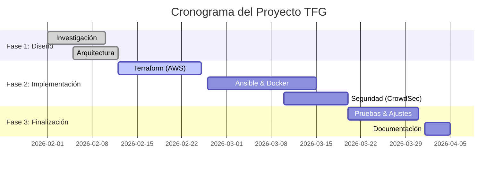
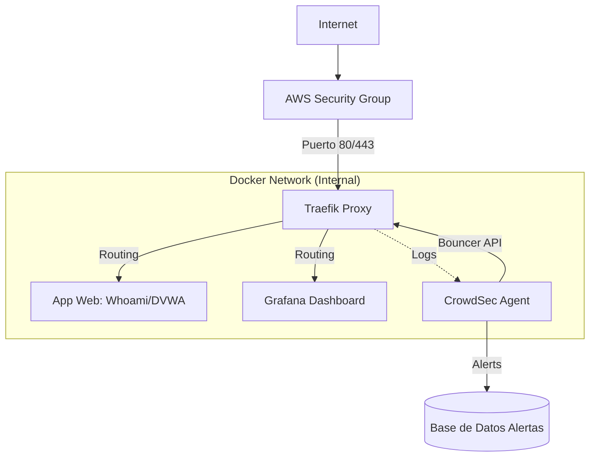

# MEMORIA DEL PROYECTO DE FIN DE GRADO (TFG)

## 1. Portada

*   **Título del TFG:** Infraestructura Cloud Automatizada y Segura (DevSecOps)
    > *[CAPTURA RECOMENDADA 1: Logo del centro educativo y logo del ciclo formativo]*
*   **Nombre del estudiante:** Rodrigo [Apellidos]
*   **Ciclo formativo y centro:** Administración de Sistemas Informáticos en Red (ASIR) - [Nombre del Centro]
*   **Tutor/a:** [Nombre del Tutor/a]
*   **Curso académico:** 2025/2026
*   **Fecha de entrega:** Abril 2026

---

## 2. Introducción

### Contexto del proyecto
En la actualidad, el paradigma de administración de sistemas ha cambiado drásticamente. Ya no es viable gestionar servidores de forma manual ("Mascotas"), sino que debemos tratarlos como recursos efímeros y reemplazables ("Ganado"). La metodología **DevSecOps** (Development, Security, and Operations) surge como respuesta a la necesidad de integrar la seguridad desde el inicio del ciclo de vida del software, en lugar de aplicarla como un parche al final.

Este proyecto simula un escenario real donde una empresa necesita desplegar una aplicación web crítica en la nube pública (AWS) de forma rápida, repetible y segura, minimizando el error humano y garantizando la disponibilidad del servicio ante ataques comunes en internet.

### Problema o necesidad detectada
Tradicionalmente, el despliegue de infraestructura conlleva problemas graves:
1.  **Configuración manual (Drift):** Los servidores configurados a mano acaban siendo diferentes entre sí con el tiempo, lo que provoca fallos inesperados ("funciona en mi máquina").
2.  **Lentitud:** Provisionar un nuevo entorno puede llevar días.
3.  **Seguridad reactiva:** Muchos servidores se exponen a internet con configuraciones por defecto, siendo vulnerables a escaneos automáticos y ataques de fuerza bruta desde el minuto cero.

Existe la necesidad crítica de una solución que automatice el despliegue completo ("Infraestructura como Código") y que incluya capas de seguridad activa (WAF/IPS) por defecto.

### Motivación personal y profesional
A nivel personal, este TFG es la culminación de los conocimientos adquiridos en ASIR, uniendo las redes, los sistemas operativos y la seguridad. A nivel profesional, el dominio de herramientas como **Terraform** y **Docker** es uno de los requisitos más demandados en el mercado laboral actual. Mi motivación es demostrar que puedo diseñar arquitecturas modernas, escalables y seguras, listas para producción.

---

## 3. Objetivos del proyecto

### Objetivo general
El objetivo principal es diseñar, implementar y documentar una infraestructura de **Alta Disponibilidad y Seguridad** en Amazon Web Services (AWS), utilizando exclusivamente código para su definición y configuración, demostrando la capacidad de recuperación ante desastres y ataques.

### Objetivos específicos
1.  **Dominio de IaC (Infrastructure as Code):** Eliminar la configuración manual en la consola de AWS, utilizando **Terraform** para definir redes, firewalls y servidores.
2.  **Automatización de Configuración:** Utilizar **Ansible** para la configuración post-despliegue del sistema operativo, garantizando que el servidor sea idéntico en cada ejecución.
3.  **Contenerización de Servicios:** Desplegar aplicaciones web mediante **Docker** y **Docker Compose**, asegurando la portabilidad y aislamiento de los servicios.
4.  **Seguridad Perimetral y de Aplicación:** Implementar **CrowdSec** como IPS (Sistema de Prevención de Intrusiones) colaborativo para detectar y bloquear ataques en tiempo real.
5.  **Observabilidad:** Implementar un stack de monitorización (**Prometheus + Grafana**) para visualizar el estado del servidor y los ataques bloqueados.

### Alcance del proyecto
El proyecto abarca el ciclo completo DevSecOps:
-   **Planificación:** Diseño de la arquitectura de red y seguridad.
-   **Código:** Escritura de los manifiestos de Terraform y Ansible.
-   **Despliegue:** Ejecución en AWS Academy.
-   **Validación:** Pruebas de penetración controladas para verificar las defensas.
    > *[CAPTURA RECOMENDADA 2: Diagrama de alto nivel mostrando las fases del proyecto]*

---

## 4. Análisis y planificación

### Investigación previa
Antes de seleccionar las herramientas concretas, se investigaron diferentes enfoques arquitectónicos para resolver el problema de los despliegues lentos y poco seguros:
-   **Despliegue On-Premise vs. Cloud:** Se evaluó la posibilidad de levantar la infraestructura en servidores locales físicos (On-Premise) frente a la nube pública. Se optó por el Cloud debido a la agilidad, la nula inversión inicial en hardware y la facilidad para simular escenarios de producción empresariales.
-   **Configuración Manual vs. Automatización (IaC):** La opción de conectarse por SSH y ejecutar scripts Bash se descartó por su falta de escalabilidad y por la dificultad de mantener un control de versiones de la infraestructura. La adopción de Infraestructura como Código (IaC) se volvió un requisito indispensable.
-   **Máquinas Virtuales vs. Contenedores:** Se analizó si era más eficiente desplegar cada servicio en una máquina virtual completa o utilizar contenedores. Se decidió que los contenedores ofrecen mayor ligereza, rapidez de inicio y garantía de portabilidad ("construir una vez, ejecutar en cualquier lugar").

### Requisitos funcionales y técnicos
*   **Hardware Virtual:** Instancia EC2 `t2.small` (1 vCPU, 2GB RAM) con Ubuntu 22.04 LTS.
*   **Conectividad:** VPC con subred pública, Internet Gateway y Security Groups restrictivos.
*   **Web:** Acceso HTTPS (443) con certificado SSL válido (Let's Encrypt).
*   **Seguridad:**
    -   SSH solo mediante clave pública (sin contraseña).
    -   Bloqueo automático de IPs tras 3 intentos fallidos de login o detección de escáneres web.

### Tecnologías seleccionadas y justificación
| Tecnología | Función | Justificación |
| :--- | :--- | :--- |
| **AWS** | Infraestructura | Estándar de la industria, robustez y API completa. |
| **Terraform** | Provisionamiento | Sintaxis declarativa, gestión del ciclo de vida de recursos. |
| **Ansible** | Configuración | Sin agentes (agentless), idempotencia y facilidad de uso con YAML. |
| **Traefik** | Proxy Inverso | Nativo para Docker, gestión automática de SSL, dashboard integrado. |
| **CrowdSec** | IPS / Seguridad | Inteligencia colaborativa (IPs baneadas por la comunidad), moderno y ligero. |
| **Grafana** | Visualización | Potente, flexible y con integración nativa con Prometheus. |

> *[PROMPT PARA DIAGRAMA]*: Usa este prompt en una herramienta de IA para generar un logo-collage de las tecnologías:
> *"A modern tech stack composition diagram featuring logos for Terraform, Ansible, Docker, AWS, Traefik, and Grafana, connected by circuit board lines, dark background, neon blue and orange accents, high quality, 4k"*

### Planificación (Gantt, fases, hitos)
El proyecto se ha desarrollado en 8 semanas, finalizando en Abril de 2026.

**Cronograma Detallado:**
1.  **Febrero (Semanas 1-2):**
    -   Investigación de herramientas.
    -   Diseño de arquitectura en papel.
    -   Creación de cuenta AWS y configuración de entorno local (VS Code).
2.  **Febrero (Semanas 3-4):**
    -   Desarrollo de scripts Terraform (`main.tf`).
    -   Pruebas de despliegue y destrucción de infraestructura base.
3.  **Marzo (Semanas 1-2):**
    -   Desarrollo de roles de Ansible.
    -   Configuración de Docker y Traefik.
    -   Integración de CrowdSec.
4.  **Marzo (Semanas 3-4):**
    -   Pruebas de seguridad (Pentesting).
    -   Configuración de Dashboards en Grafana.
5.  **Abril (Semana 1):**
    -   Redacción de la memoria final.
    -   Preparación de la defensa.

---

## 5. Diseño del sistema

### Arquitectura general
La infraestructura se ha diseñado siguiendo el principio de "mínimo privilegio" y defensa en profundidad.

1.  **Nivel Cloud (AWS):**
    -   Un **Security Group** actúa como firewall virtual, permitiendo tráfico *solo* en los puertos 22 (SSH), 80/443 (Web) y 3000/8080 (Monitorización temporal). Todo lo demás está bloqueado por defecto.
    > *[CAPTURA RECOMENDADA 3: Consola de AWS mostrando las reglas de entrada del Security Group]*

2.  **Nivel Sistema (Ubuntu):**
    -   El sistema operativo base es una imagen mínima de Ubuntu. No se instalan servicios innecesarios.

3.  **Nivel Aplicación (Docker):**
    -   Todos los servicios corren en contenedores aislados que no exponen puertos al host, salvo el Proxy Inverso (Traefik). Traefik es la única puerta de entrada al clúster Docker.

### Diagramas
#### Diagrama de Arquitectura (Lógico)

> *[PROMPT PARA DIAGRAMA]*: Usa este prompt para generar una versión 3D "visual" de la arquitectura:
> *"Isometric 3D cloud architecture diagram. Center implementation: Server rack with glowing blue lights labeled 'Docker Host'. Connected to a shield icon labeled 'CrowdSec'. Floating above: AWS Cloud logo. Connections representing network traffic. High tech, clean white background, professional style."*

### Diseño de interfaz
La gestión visual del sistema se realiza a través de dos paneles principales:
1.  **Traefik Dashboard:** Permite ver en tiempo real qué servicios están activos y el estado de los routers HTTP.
2.  **Grafana:** Panel centralizado donde se visualizan métricas de sistema (CPU, RAM) y métricas de seguridad (ataques por país, tipos de ataque, IPs bloqueadas).

### Consideraciones de accesibilidad y usabilidad
Se ha configurado todo para ser accesible vía web HTTPS, utilizando certificados SSL válidos para evitar las alertas de seguridad del navegador. Esto mejora la usabilidad para el administrador, que puede gestionar el servidor desde cualquier dispositivo seguro.

---

## 6. Desarrollo

### Entorno de desarrollo
El código se ha escrito utilizando **Visual Studio Code** en un entorno local con WSL2 (Windows Subsystem for Linux).
> *[CAPTURA RECOMENDADA 4: Captura de pantalla de tu VS Code con el árbol de directorios a la izquierda y el archivo `main.tf` abierto]*

### Tecnologías implementadas: Detalle Técnico

#### 1. Terraform (Infraestructura)
Se definió un archivo `main.tf` que describe la instancia EC2. Se utilizó el recurso `aws_instance` y `aws_security_group` para vincular el firewall a la máquina.
> *[CAPTURA RECOMENDADA 5: Fragmento de código de `main.tf` mostrando la definición del recurso `aws_instance`]*

#### 2. Ansible (Configuración)
Se creó un `playbook.yml` que realiza las siguientes tareas de forma secuencial:
-   Actualizar repositorios (`apt update`).
-   Instalar paquetes base (Docker, Git, Pip).
-   Clonar el repositorio con los archivos de Docker Compose.
-   Levantar el stack de contenedores.
> *[CAPTURA RECOMENDADA 6: Salida de terminal mostrando la ejecución exitosa de Ansible con las tareas en color verde/amarillo]*

#### 3. Docker Compose (Servicios)
El archivo `docker-compose.yml` orquesta 5 servicios principales:
-   **Traefik:** Gestiona el tráfico entrante.
-   **CrowdSec:** Analiza logs.
-   **Whoami:** Microservicio de prueba.
-   **DVWA (Damn Vulnerable Web App):** Aplicación intencionalmente insegura para probar las defensas.
-   **Prometheus/Grafana:** Stack de monitorización.

### Problemas encontrados y soluciones aplicadas
1.  **Bloqueo de Terraform:** Inicialmente, Terraform se quedaba bloqueado al validar. Se solucionó limpiando los archivos de estado (`.terraform.lock.hcl`) y simplificando el proveedor AWS.
2.  **Permisos de Docker:** Ansible fallaba al intentar ejecutar comandos docker sin `sudo`. Se solucionó añadiendo el usuario `ubuntu` al grupo `docker` en el playbook.
3.  **Límites de Let's Encrypt:** Al realizar muchos despliegues, se alcanzó el límite de certificados. Se configuró Traefik para usar el entorno de "Staging" durante el desarrollo.

---

## 7. Resultados

### Demostración del producto
Tras el despliegue automático, la infraestructura es totalmente funcional.
1.  **Acceso Web Seguro:** Al entrar a la IP pública, el navegador muestra el candado de seguridad (HTTPS).
    > *[CAPTURA RECOMENDADA 7: Navegador mostrando la web 'whoami' con el candado HTTPS activado]*

2.  **Escalabilidad:** Se pueden añadir nuevos servicios simplemente añadiendo pocas líneas al `docker-compose.yml`; Traefik los detecta y configura automáticamente.

### Capturas o vídeo del funcionamiento

**Panel de Traefik:**
Muestra el enrutado dinámico de los servicios.
> *[CAPTURA RECOMENDADA 8: Dashboard de Traefik mostrando la lista de servicios (routers) en verde]*

**Panel de Grafana:**
Muestra el "pulso" del servidor.
> *[CAPTURA RECOMENDADA 9: Dashboard de Grafana con gráficas de tráfico y un contador de "Ataques Bloqueados"]*

### Métricas o pruebas realizadas
Se realizó una prueba de concepto de seguridad crítica:
1.  **Ataque:** Se utilizó la herramienta `Nikto` para escanear vulnerabilidades en la aplicación DVWA.
2.  **Detección:** CrowdSec detectó el patrón de escaneo (http-probing).
3.  **Reacción:** En menos de 2 segundos, la IP del atacante fue añadida a la lista negra.
4.  **Resultado:** El atacante recibió un error **403 Forbidden** en todas las peticiones subsiguientes.
    > *[CAPTURA RECOMENDADA 10: Captura dividida. A la izquierda, la terminal del atacante recibiendo error 403. A la derecha, los logs de CrowdSec mostrando "Ban added para IP X"]*

---

## 8. Conclusiones

### Logros alcanzados
Se ha cumplido el objetivo de **automatización total**. Desde cero hasta tener un servidor seguro y monitorizado, el tiempo de despliegue se ha reducido de ~4 horas (manual) a ~5 minutos (automático). Además, la seguridad es proactiva, no reactiva.

### Aprendizajes técnicos y personales
Este proyecto me ha permitido entender la complejidad real de los entornos cloud. He aprendido que la automatización, aunque difícil de implementar al principio, paga dividendos enormes en mantenimiento y estabilidad a largo plazo. También he profundizado en cómo funcionan los ataques web reales y cómo mitigarlos eficazmente.

### Limitaciones del proyecto
Debido a las restricciones de la cuenta de estudiante de AWS Academy, la infraestructura se ha limitado a una sola zona de disponibilidad. En un entorno real de producción, esto debería desplegarse en un **Auto Scaling Group** a través de múltiples zonas (Multi-AZ) para garantizar tolerancia a fallos físicos del data center.

---

## 9. Líneas futuras de mejora

### Funcionalidades pendientes
*   **Backup Off-site:** Implementar copias de seguridad automáticas de los volúmenes de Docker hacia un bucket S3 con versionado.
*   **WAF Avanzado:** Implementar reglas propias en CrowdSec para mitigar ataques específicos de lógica de negocio, no solo ataques genéricos.

### Escalabilidad
El siguiente paso lógico sería migrar los contenedores a **Kubernetes (EKS)** o **ECS**. Esto permitiría gestionar no solo un servidor, sino cientos de ellos, orquestando la carga de trabajo de forma dinámica.

### Evolución del proyecto en un entorno real
Este TFG sienta las bases para una infraestructura profesional. El código resultante es modular y reutilizable, pudiendo servir como plantilla base (boilerplate) para futuros proyectos de despliegue web seguro en la empresa.
