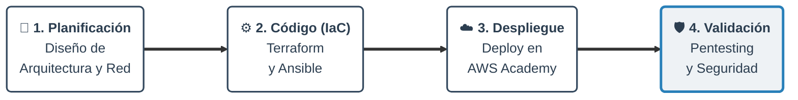

# Infraestructura Cloud Automatizada y Segura (DevSecOps)

**Autor:** Rodrigo [Apellidos]  
**Ciclo Formativo:** Administración de Sistemas Informáticos en Red (ASIR)  
**Centro:** [Nombre del Centro]  
**Tutor/a:** [Nombre del Tutor/a]  
**Curso Académico:** 2025/2026  

---

# 1. Introducción al Proyecto

### De "Mascotas" a "Ganado"
- El paradigma ha cambiado: los servidores son recursos **efímeros y reemplazables**.
- **DevSecOps:** Integración de la seguridad desde el inicio del ciclo de vida del software.

### Escenario Real
- Despliegue de una aplicación web crítica en la nube pública (AWS).
- Objetivos: Rapidez, repetibilidad, seguridad y minimizar el error humano.

---

# 2. El Problema Detectado

El despliegue tradicional de infraestructura conlleva graves problemas:

1. **Configuración manual (Drift):** Los servidores acaban siendo diferentes ("funciona en mi máquina").
2. **Lentitud:** Provisionar un nuevo entorno lleva días.
3. **Seguridad reactiva:** Servidores expuestos a internet con configuraciones por defecto (vulnerables desde el minuto cero).

---

# 3. La Solución: DevSecOps

**Infraestructura como Código (IaC) y Seguridad Proactiva.**

- Automatización del despliegue completo.
- Capas de seguridad activa (WAF/IPS) por defecto.

**Motivación:**  
Culminación de conocimientos en ASIR (redes, sistemas, seguridad). Dominio de herramientas altamente demandadas como **Terraform** y **Docker**.

---

# 4. Objetivos del Proyecto

**Objetivo General:**  
Diseñar, implementar y documentar una infraestructura de **Alta Disponibilidad y Seguridad** en AWS mediante código, resistente a caídas y ataques.

**Objetivos Específicos:**
1. **IaC:** Terraform para redes y servidores.
2. **Configuración:** Ansible para provisionamiento.
3. **Contenerización:** Docker / Docker Compose.
4. **Seguridad:** CrowdSec (IPS colaborativo).
5. **Observabilidad:** Prometheus + Grafana.

---

# 5. Alcance del Proyecto

El ciclo completo DevSecOps:

- **Planificación:** Diseño de red y seguridad.
- **Código:** Terraform y Ansible.
- **Despliegue:** AWS Academy.
- **Validación:** Pentesting y pruebas de estrés.

---

# 6. Análisis: Elección de Tecnologías

Razones de la selección de nuestras herramientas principales:

- **Nube:** AWS (Líder del mercado, robustez, créditos educativos).
- **Aprovisionamiento:** Terraform (Agnóstico, frente a alternativas como CloudFormation).
- **Orquestación:** Docker Compose (Ligero y más adecuado que Kubernetes para la magnitud de este despliegue).

---

# 7. Stack DevSecOps Seleccionado

| Tecnología | Rol | Justificación |
| :--- | :--- | :--- |
| **AWS** | Cloud | Estándar de la industria |
| **Terraform** | IaC | Sintaxis declarativa (HCL) |
| **Ansible** | Configuración | Agentless, idempotencia |
| **Traefik** | Proxy Inverso | Nativo de Docker, SSL automático |
| **CrowdSec** | IPS/Seguridad | Inteligencia colaborativa comunitaria |
| **Grafana** | Monitorización | Integración nativa con Prometheus |

---

# 8. Requisitos de la Infraestructura

- **Hardware:** Instancia EC2 `t2.small` (Ubuntu 22.04 LTS).
- **Red:** VPC pública con Internet Gateway.
- **Firewall (Security Groups en AWS):** 
  - Tráfico permitido ÚNICAMENTE en puertos 22 (SSH) y 80/443 (Web/HTTPS).
- **Seguridad y Accesos:**
  - SSH mediante clave pública (sin contraseña).
  - Bloqueo automático de IP hostiles (Intrusiones/Escaneos).
  - Certificados SSL válidos obligatorios (Let's Encrypt).

---

# 9. Planificación y Cronograma

*Duración: 8 semanas - Finalización: Abril 2026*

# 9. Planificación y Cronograma

*Duración: 8 semanas - Finalización: Abril 2026*

| Fase | Tarea Principal | Semanas | Estado |
| :--- | :--- | :--- | :--- |
| **Fase 1: Diseño** | Investigación y Arquitectura | 1 - 2 | ✅ Completado |
| **Fase 2: IaC** | Terraform en AWS | 3 - 4 | 🔄 En progreso |
| **Fase 3: Deploy** | Ansible & Docker (Traefik/CrowdSec) | 5 - 6 | ⏳ Pendiente |
| **Fase 4: Cierre** | Pruebas de estrés y Pentesting | 7 | ⏳ Pendiente |
| **Fase 4: Cierre** | Documentación y Memoria | 8 | ⏳ Pendiente |

> **PROMPT PARA GENERAR IMAGEN EN BANANO PRO:**
> *"A professional, clean Gantt chart infographic showing a 4-phase tech project. Timeline from February to April. Phase 1: Planning (Completed). Phase 2: Infrastructure as Code (In Progress). Phase 3: Deployment (Pending). Phase 4: Security and Documentation (Pending). Minimalist corporate design, pure white background, flat UI style, simple and clear horizontal timeline bars, NO abstract or weird elements, high resolution, highly legible."*
